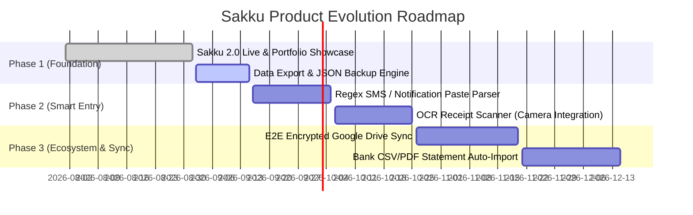

# 📱 SAKKU 2.0 — Product Strategy, Competitor Analysis & Engineering Roadmap

> **Document Version:** 1.0.0  
> **Last Updated:** 2026-09-01  
> **Author & Architect:** Ahlul Firdaus  
> **Live App:** [https://sakku.ahlulfirdaus.com/](https://sakku.ahlulfirdaus.com/)  
> **Product Category:** Privacy-First Personal Finance & Wealth Operating System  

---

## 🎯 1. Executive Summary & Product Vision

**Sakku 2.0** *(evolusi dari Kocekku / MyFinance)* adalah aplikasi manajemen keuangan dan kekayaan pribadi yang dirancang dengan filosofi **"Privacy-First, Zero-Latency, Zero-Subscription"**.

Berbeda dengan aplikasi finansial umum yang sering menjual data pengguna atau memungut biaya langganan mahal, Sakku 2.0 memberikan kontrol kedaulatan data 100% kepada pengguna melalui arsitektur *Local-First / Offline-First* dengan visualisasi kelas eksekutif (*Net Worth*, *Savings Rate*, *Budgeting Progress*, dan *Cash Flow*).

---

## 📊 2. Competitor Benchmark Matrix

| Parameter / Fitur | **Sakku 2.0** | **Finku / Sribuu (Lokal)** | **Catatan Keuangan (AndroMedia)** | **YNAB (You Need A Budget)** | **Monefy / Spendee** |
| :--- | :--- | :--- | :--- | :--- | :--- |
| **Model Bisnis** | **100% Gratis / Portofolio Showcase** | Freemium / Iklan Produk Keuangan | Iklan Banner & Video Mengganggu | Berbayar Mahal ($14.99/bln) | Freemium ($3-$5/bln) |
| **Penyimpanan Data** | **100% Privat di Perangkat (Offline-First)** | Cloud Server Pihak Ketiga | Lokal / Cloud Backup | Cloud AWS / US Server | Cloud Server |
| **Keamanan Perbankan** | **Aman (Tidak butuh PIN/Akses Bank)** | Membutuhkan Akses Open Banking | Aman (Manual) | Bank Sync (AS/Eropa) | Manual / Sync |
| **Visual Telemetry** | **Net Worth + Budget + Savings Rate %** | Standar Cashflow | Sangat Sederhana / Jadul | Metodologi Zero-Based | Grafik Pie Sederhana |
| **Kecepatan & Latensi** | **Ultra Cepat (Instan PWA/Next.js)** | Kadang Lambat (Fetch Cloud) | Standar Native Android | Cepat | Cepat |

---

## 🛠️ 3. Rencana Strategis Perbaikan (Solving the 4 Limitations)

Berikut adalah rencana konkret untuk mengatasi 4 kekurangan utama Sakku 2.0:

---

### 🔹 Solusi 1: Smart OCR Receipt Scanner (Pindai Struk Belanja Otomatis)
* **Tantangan Saat Ini:** Pengguna harus mengetik nominal belanja secara manual.
* **Rencana Solusi:**
  1. **Client-side OCR / Lightweight AI API**: Menambahkan tombol kamera 📷 di form transaksi untuk memotret struk belanja (Indomaret, Alfamart, Restoran, Supermarket).
  2. **Smart Extractor**: Algoritma otomatis membaca:
     - Nama Toko / Merchant (misal: *Indomaret*)
     - Tanggal Transaksi
     - Total Belanja Akhir (Grand Total)
     - Rekomendasi Kategori Otomatis (*Groceries / Food*)
  3. **Privacy Guarantee**: Gambar diproses langsung di browser (menggunakan `Tesseract.js` atau mini API call tanpa menyimpan foto di database publik).

---

### 🔹 Solusi 2: Zero-Knowledge End-to-End Encrypted Cloud Sync (Cadangan Aman)
* **Tantangan Saat Ini:** Data tersimpan di `localStorage`. Jika cache browser dibersihkan, data berisiko hilang.
* **Rencana Solusi:**
  1. **Fitur Auto-Backup ke File / Google Drive / WebDAV**:
     - Opsi 1: Otomatis download backup berkala dalam format JSON terenkripsi (`sakku_backup_YYYY-MM-DD.enc`).
     - Opsi 2: Integrasi sync ke Google Drive pribadi pengguna sendiri (Zero-Knowledge Cloud), sehingga developer tidak memiliki akses ke data tersebut.
  2. **Passphrase Protection**: Data dienkripsi dengan algoritma `AES-256` menggunakan password rahasia yang hanya diketahui oleh pengguna.

---

### 🔹 Solusi 3: Multi-Device Sync & Family Shared Vault
* **Tantangan Saat Ini:** Data di HP tidak otomatis muncul di Laptop.
* **Rencana Solusi:**
  1. **P2P QR Sync (Direct Device Pairing)**:
     - Scan QR Code dari Laptop ke HP untuk mentransfer data instan secara lokal via WebRTC/Local Network tanpa perantara server.
  2. **Multi-User Family Mode**:
     - Kemampuan membagi *Envelope Budget* antar anggota keluarga (misal: Ayah, Ibu) dengan sinkronisasi terenkripsi via Supabase Row-Level Security (RLS).

---

### 🔹 Solusi 4: Semi-Automated Mutation & Notification Parser
* **Tantangan Saat Ini:** Belum ada integrasi mutasi otomatis dari rekening bank Indonesia (BCA, Mandiri, BRI, GoPay, OVO).
* **Rencana Solusi:**
  1. **SMS / WhatsApp Notification Quick-Paste (Catat Cepat)**:
     - Pengguna cukup menyalin teks notifikasi SMS/M-Banking (contoh: *"BCA: Transaksi QRIS Rp 45.000 di Kopi Kenangan"*), lalu sistem regex otomatis mendeteksi akun pengurang, kategori, dan nominal.
  2. **Drag-and-Drop E-Statement (PDF/CSV Importer)**:
     - Fitur unggah file mutasi bulanan bank (BCA/Mandiri/GoPay CSV) untuk langsung di-import ratusan transaksi dalam hitungan detik.

---

## 🗺️ 4. Phased Implementation Roadmap

---

## 💼 5. Narasi Nilai Tambah untuk Portofolio Ahlul Firdaus

Saat mempresentasikan **Sakku 2.0** kepada calon klien atau *technical recruiter*, tonjolkan poin arsitektur berikut:

1. **High-Density Data Architecture**: Kemampuan merancang sistem finansial yang menyajikan data kompleks (*Net Worth, Cashflow, Burn Rate, Savings Rate*) dalam visualisasi yang intuitif dan mudah dipahami dalam 3 detik.
2. **Privacy-Centric Engineering**: Menjawab tren global mengenai kepatuhan privasi data (*GDPR / UU PDP*) dengan arsitektur *Zero-Knowledge* & *Local-First*.
3. **PWA Mobile-First Performance**: Membangun aplikasi web dengan performa setara *native app*, responsif di segala ukuran layar, dan mendukung penggunaan offline tanpa ketergantungan koneksi internet.

---
*Dokumen ini tersimpan secara permanen di repository portofolio (`docs/SAKKU_ROADMAP_AND_IMPROVEMENT_PLAN.md`).*
